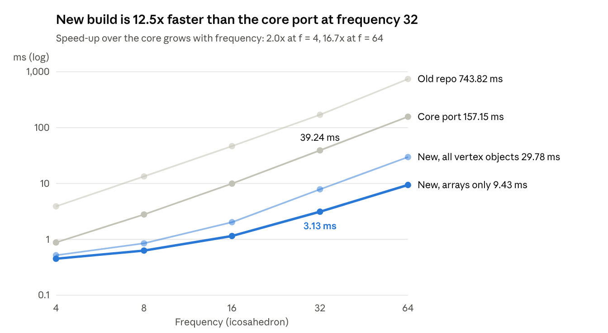

# GeodesicDome performance optimisation

7 October 2026 · Masahiro Takatsuka

Scripts and raw data: [benchmarks/](../benchmarks/README.md).

## Summary

The rewritten GeodesicDome now builds a frequency-32 icosahedral dome in 3.1 ms using 1.21 MiB, against 39 ms and 4.50 MiB for the standalone `geodesic_grid_core.py`. That is 12.5x faster and about a quarter of the memory. The old repo version needed 170 ms and 7.43 MiB.

Hop searches are about 1.7x faster than the core at every radius. Outputs are bit-for-bit identical to the old implementation. Memory only exceeds the core in one case: when a single dome uses both the old vertex-object API and the new index API (5.65 MiB vs 4.50 MiB at f = 32).

Changed files: `src/mt/geodesicdome/grid/geodesicdome.py`, `src/mt/geodesicdome/vertex.py` and `CHANGELOG.md`.

## Why the old version was slow

The old code built every stored position as a full Python object, one at a time. Most of its cost came from per-vertex overhead rather than geometry:

- **Small NumPy arrays per vertex.** Each new point was a 3-element array, interpolated and normalised with separate NumPy calls. NumPy's per-call overhead dwarfs the arithmetic on three numbers.
- **Eager latitude/longitude.** Every vertex computed `latlon_coord` at creation through several trigonometric calls, even though few callers read it.
- **Heavy objects.** Each vertex had an instance dictionary plus two unused per-vertex lists (`vertices`, `triangles`).
- **Bounds checks in every neighbour lookup.** `get_neighbours` recomputed column offsets and ranges each call. Searches also needed visited flags, so callers had to reset every vertex between queries.

The core port gained its 4x mainly by using plain tuples and `__slots__`, and by caching neighbour lists. It still builds every vertex as a Python object.

## What changed

The dome now keeps its data in a few NumPy arrays and creates Python objects only when asked. Four changes carry the result.

1. **Array-first storage.** A dome holds coordinates (N x 3), grid positions, a dense index grid, faces, the six grid neighbours of every position, and a seam class per position (seam copies share one class). Storage order is unchanged, so row `i` is still `vertex.id` and row `i` of `get_all_xyz()`.
2. **Vectorised construction.** The icosahedron split subdivides every grid cell at once: column edges, row edges, the cell diagonal, then the two triangle interiors along lines parallel to the diagonal. This uses the same interpolate-then-normalise steps, in the same order, as the old code. Norms go through `matmul`, which uses the same dot kernel as `np.linalg.norm`, so results match bit for bit. Only the seam walk stays in Python, and it touches O(f) positions. The tetrahedron and dodecahedron nets build every face's lattice in one pass and find seam copies by grouping barycentric keys.
3. **Lazy vertex objects.** `GeodesicVertex` objects are created on first access (`vertices`, `get_all_vertices`, `get_vertex_at`, `get_neighbours`). They use `__slots__`. `coord` is a view of the dome's array, made on first read, and `latlon_coord` is computed on first read. `get_all_xyz`, `get_all_triangles` and `compute.DomeArrays` (GeoSOM's path) never create them.
    1. A cached neighbour table makes `get_neighbours` and `get_neighbours_in_distance` 3-4x faster while keeping their exact order and visited-flag behaviour.
4. **Index-based hop search.** `within_hops` runs a breadth-first search over distinct sphere points, using a cached adjacency of representative positions and integer visit stamps. It needs no vertex objects and no `unmark_vertices()`.

## Results

The new dome builds faster than both other versions at every frequency, and its lead over the core widens as the dome grows.

*Median of 3 builds; data in [benchmarks/results/icosahedron.csv](../benchmarks/results/icosahedron.csv).*

Creating every vertex object still leaves the new build 5x faster than the core at f = 32 (7.9 ms vs 39 ms).

### Hop searches, f = 32

The new index search is about 1.7x faster than the core at every radius.

| Search | Old repo | Core port | New, arrays only | New, vertex objects |
| --- | --- | --- | --- | --- |
| 1 hop (µs) | 1.3 | 1.2 | 0.7 | 1.2 |
| 3 hops (µs) | 12.9 | 5.8 | 3.2 | 4.5 |
| 6 hops (µs) | 56.7 | 21.4 | 12.1 | 16.6 |
| Whole sphere, 96 hops (ms) | 8.14 | 2.06 | 1.18 | 1.61 |

### Memory, f = 32

Memory depends on which structures a program uses, because the new dome builds each one on first use.

| Usage | Memory (MiB) | vs core |
| --- | --- | --- |
| Old repo | 7.43 | 165% |
| Core port | 4.50 | 100% |
| New, arrays only (GeoSOM path) | 1.21 | 27% |
| New + hop index (`within_hops`) | 2.56 | 57% |
| New + vertex objects and neighbour table (old API) | 4.27 | 95% |
| New, everything built | 5.65 | 126% |

The arrays take 1.19 MiB, the hop index 1.37 MiB, the vertex objects 2.11 MiB and the object neighbour table 0.97 MiB. Rows 4–5 add these parts from a separate run, so they can differ from the other rows by about 0.02 MiB.

### Other base solids

| Base | Version | Build (ms) | Memory (MiB) |
| --- | --- | --- | --- |
| Tetrahedron, f = 64 | Old repo | 236.9 | 7.46 |
| Tetrahedron, f = 64 | Core port | 37.0 | 3.57 |
| Tetrahedron, f = 64 | New, arrays only | 7.9 | 0.95 |
| Tetrahedron, f = 64 | New, vertex objects | 11.2 | 2.60 |
| Dodecahedron, f = 32 | Old repo | 1035.7 | 26.99 |
| Dodecahedron, f = 32 | Core port | 231.3 | 14.77 |
| Dodecahedron, f = 32 | New, arrays only | 23.3 | 3.20 |
| Dodecahedron, f = 32 | New, vertex objects | 35.5 | 9.40 |

## Correctness

The new implementation reproduces the old one exactly. Each check below ran against a saved copy of the original source ([check_equivalence.py](../benchmarks/check_equivalence.py), [check_hops.py](../benchmarks/check_hops.py)).

| Check | Scope | Result |
| --- | --- | --- |
| Old vs new outputs | 44 cases: 3 bases + generic icosahedron net, f = 1–16, cumulative splits (2·3, 3·2·2) | Bit-for-bit identical coordinates, storage order, faces, seam lists, neighbour order and rings |
| `within_hops` vs ring search | 2,905 random queries, 0–40 hops, all bases | Same sets of sphere points |
| GeodesicDome tests | Full suite | 80 passed |
| GeoSOM tests | Run against the new dome | 122 passed |
| ruff | Changed files | All checks passed |

## API changes

Existing code keeps working. The changes are additions plus a few behaviour details.

| Kind | Item | Detail |
| --- | --- | --- |
| New | `within_hops(i, hops)` | Positions within a number of grid steps; no vertex objects or visited flags |
| New | `neighbour_ids(i)` | Direct neighbours of position `i`, seams included |
| New | `within_arc(i, angle)` | Positions within a great-circle angle (radians) |
| New | `n_points`, `point_index` | Number of distinct sphere points; the point each stored position holds |
| Changed | Vertex objects | Created on first access |
| Changed | `__slots__` | `Vertex` and `GeodesicVertex` use slots; other attributes can still be added |
| Changed | `vertex.coord` | A view of the dome's coordinate array; writing to it updates the dome |
| Changed | `vertex.latlon_coord` | Computed on first read |
| Changed | `vertex.id`, `vertex.manifold` | `id` set at creation; `manifold` is the dome |
| Changed | `IcosahedronDome.split()` | Creates new vertex objects, as the other bases already did; rejects non-integer factors |
| Removed | `vertex.vertices`, `vertex.triangles` | Unused per-vertex empty lists |

## Method

Measured on 7 October 2026 in a Linux VM (Python 3.10, NumPy 2.2.6). Build time is the median of 3 constructions; query times are medians of 80 runs (20 for whole-sphere searches). Memory is tracemalloc live allocation after construction, not process RSS.

The old repo and "new with vertex objects" hop times use `get_neighbours_in_distance` plus a reset of the touched visited flags; the core and "new, arrays only" use `within_hops`. The query starts from the middle stored position. "Old repo" is git `6f664da`; "core port" is the standalone `geodesic_grid_core.py`, which is not part of this repository. All figures are in [benchmarks/results.xlsx](../benchmarks/results.xlsx).
